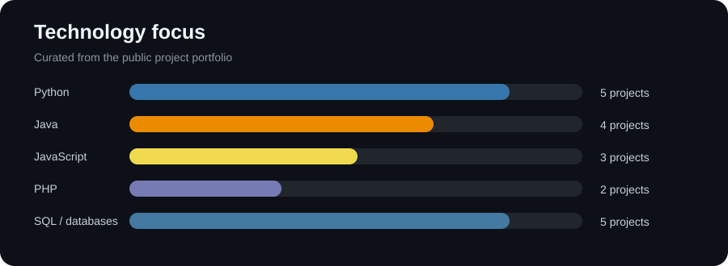
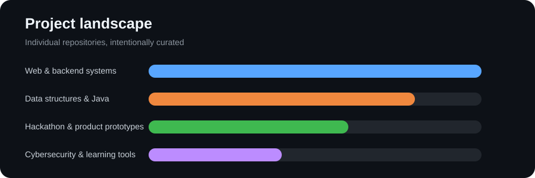

# Hi, I'm Imad Ahmad 👋

### Software Engineering Student | Full-Stack Developer | Systems Builder

I build practical software across web applications, backend systems, data structures, cybersecurity, and product prototypes. My focus is clear architecture, explainable behavior, reliable workflows, and useful user experiences.

## Featured projects

| Project | What it demonstrates |
|---|---|
| [CareSignal](https://github.com/imadahmad9507-ops/CareSignal) | Explainable health trend monitoring with Flask, SQLite, deterministic rules, charts, and safety-first AI wording |
| [Banking System](https://github.com/imadahmad9507-ops/Banking-System) | Custom data structures, transactions, REST workflows, approvals, and undo/redo |
| [Hospital Management System](https://github.com/imadahmad9507-ops/Hospital-Management-System) | PHP/MySQL patient and administration workflows |
| [Smart Transportation System](https://github.com/imadahmad9507-ops/SmartTransportationSystem) | Java transportation domain modelling |
| [CargoConnects](https://github.com/imadahmad9507-ops/CargoConnects) | Logistics product design, shipment tracking, and stakeholder portals |
| [EnigmaSimulator](https://github.com/imadahmad9507-ops/EnigmaSimulator) | Cryptography education, rotor stepping, and block-cipher comparison |
| [NeoBank](https://github.com/imadahmad9507-ops/NeoBank) | Data-structure-driven banking workflows |
| [OASIS](https://github.com/imadahmad9507-ops/OASIS) | Healthcare scheduling and administrative workflows |
| [BloodBank](https://github.com/imadahmad9507-ops/BloodBank) | Object-oriented inventory and patient management |
| [ConnectMessenger](https://github.com/imadahmad9507-ops/ConnectMessenger) | React/FastAPI real-time communications prototype |

## Technology focus

        

## Portfolio analytics

These charts are stored in this repository, so they render reliably without third-party GitHub API calls or rate limits.

## Certifications

- [Introduction to Cybersecurity Fundamentals — Coursera](https://coursera.org/verify/MST0HFRIIAO9), completed July 4, 2025
- Harvard HSIL Hackathon certificate — listed from the local certificate record

## Professional principles

- Keep secrets, credentials, and private data out of public repositories.
- Document trade-offs and limitations honestly.
- Prefer maintainable systems over impressive-looking shortcuts.
- Use charts to communicate engineering work clearly without depending on unstable services.
