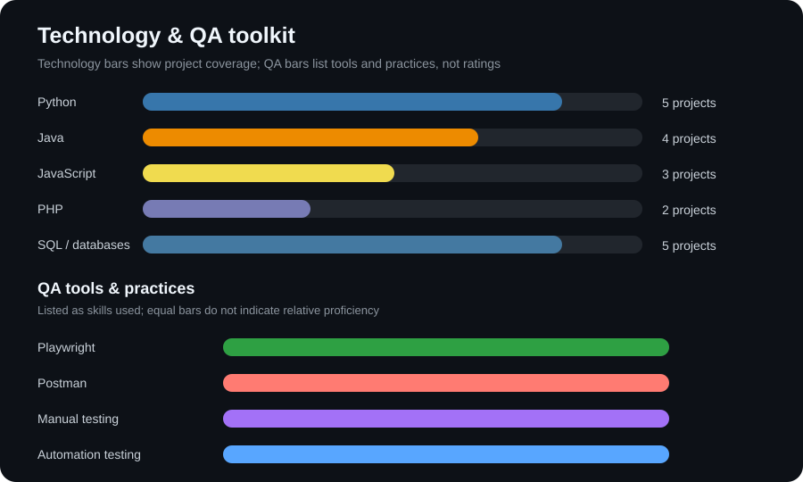
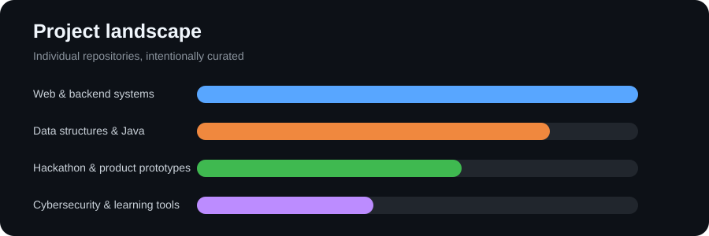

# Hi, I'm Imad Ahmad 👋

### Software Engineer | Transitioning into QA | Project Leadership | Future Project/Product Management

I am a software engineer moving toward quality assurance, bringing hands-on testing experience and project leadership across the applications I have built and worked on. I plan and perform manual testing, use Playwright for browser automation where applicable, document test cases and findings, assess severity and priority, and capture screenshots and recordings for project reports and submissions. I also coordinate project work through completion and am interested in growing toward project or product management.

## Project portfolio and QA work

| Project | QA work or engineering focus |
|---|---|
| [Calculator Hub](https://github.com/imadahmad9507-ops/calculator-hub) | Manual testing across multiple pages and Playwright automation; test cases, reports, and captured evidence. |
| [CareSignal](https://github.com/imadahmad9507-ops/CareSignal) | Manual and Playwright testing, test cases, reports, and captured evidence. [Testing status](https://github.com/imadahmad9507-ops/CareSignal/blob/master/TESTING.md). |
| [Banking System](https://github.com/imadahmad9507-ops/Banking-System) | Custom data structures, transactions, REST workflows, approvals, and undo/redo |
| [Hospital Management System](https://github.com/imadahmad9507-ops/Hospital-Management-System) | PHP/MySQL patient and administration workflows |
| [Smart Transportation System](https://github.com/imadahmad9507-ops/SmartTransportationSystem) | Java transportation domain modelling |
| [CargoConnects](https://github.com/imadahmad9507-ops/CargoConnects) | Manual and Playwright testing, test cases, final report, and captured evidence. |
| [EnigmaSimulator](https://github.com/imadahmad9507-ops/EnigmaSimulator) | Cryptography education, rotor stepping, and block-cipher comparison |
| [NeoBank](https://github.com/imadahmad9507-ops/NeoBank) | Manual and Playwright testing, test cases, severity/priority assessment, final report, and captured evidence. |
| [OASIS](https://github.com/imadahmad9507-ops/OASIS) | Manual testing, test cases, reports, and screenshot/screen-recording evidence. |
| [BloodBank](https://github.com/imadahmad9507-ops/BloodBank) | Manual testing, test cases, reports, and screenshot/screen-recording evidence. |
| [ConnectMessenger](https://github.com/imadahmad9507-ops/ConnectMessenger) | Manual testing across multiple pages and Playwright automation; test cases, reports, and captured evidence. |

## QA and project leadership

I have led and coordinated project delivery while contributing hands-on QA across OASIS, Blood Bank, Cargo Connects, NeoBank, Calculator Hub, ConnectMessenger, and CareSignal. My testing and delivery work includes:

- Manual testing across project workflows and multiple application pages.
- Browser automation using Playwright where applicable.
- Writing test cases and documenting results in final reports.
- Recording issue severity and priority to help teams address findings.
- Capturing screenshots and screen recordings as test evidence.
- Coordinating project work and submissions through completion.

My software engineering background supports a transition into QA. Longer term, I am interested in growing toward project or product management.

## QA skill set

- Manual testing
- Automation testing
- Playwright
- Postman API testing
- Test-case design and execution
- Defect reporting, severity, and priority assessment
- Screenshot and screen-recording evidence

## Technology focus

        

## Portfolio analytics

These charts are stored in this repository, so they render reliably without third-party GitHub API calls or rate limits.

## Certifications

- [Introduction to Cybersecurity Fundamentals — Coursera](https://coursera.org/verify/MST0HFRIIAO9), completed July 4, 2025
- Harvard HSIL Hackathon certificate — listed from the local certificate record

## Professional principles

- Keep secrets, credentials, and private data out of public repositories.
- Document trade-offs and limitations honestly.
- Prefer maintainable systems over impressive-looking shortcuts.
- Use charts to communicate engineering work clearly without depending on unstable services.
